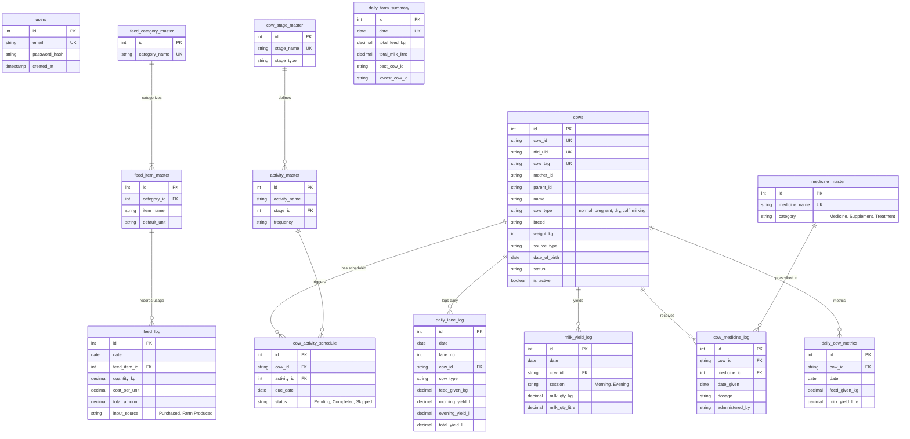

# DairySense Database Schema

This document outlines the entire PostgreSQL database architecture for DairySense. For your meeting, you can use the interactive ER diagram or the module breakdowns below.

## 🔗 Entity-Relationship Diagram

---

## 🏗️ Core Modules Breakdowns

### 1. Authentication & Users
- **`users`**: Secure backend table handling dashboard access. Tracks `email` (unique) and `password_hash`.

### 2. Cattle Management
- **`cows`**: The primary master entity describing every animal on the farm.
  - Generates a unique string `cow_id` (e.g. COW-001) alongside native integer `id`.
  - Supports genetics tracking (`mother_id`, `parent_id`), identification (`cow_tag`, `rfid_uid`), profiling (`name`, `breed`, `weight_kg`, `cow_type`), and health histories.

### 3. Production & Logging
- **`daily_lane_log`**: The fundamental daily physical operation log. Aggregates data by unique pairs of `[date, lane_no, cow_id]`. Tracks both `feed_given_kg` and specific `morning_yield_l` / `evening_yield_l`.
- **`milk_yield_log`**: Detailed parallel logging specific strictly to milk yields per `Morning` or `Evening` session.

### 4. Feed & Inventory Management
- **`feed_category_master`**: Base groupings like *Concentrated Feed*, *Dry Fodder*, etc.
- **`feed_item_master`**: Individual feed types like *Hay Stack* and *Corn Flour*. Tied to their Categories.
- **`feed_log`**: Captures bulk tracking of how feed is consumed across the farm. Records exact financial and stock costs mapping to `quantity_kg`, `cost_per_unit`, `total_amount`, and where the feed came from (`input_source`).
- **`cow_weight_groups` & `feed_requirement_rules`**: Links feed consumption formulas to different cow weight profiles dynamically.

### 5. Veterinary & Medicine
- **`medicine_master`**: A directory detailing all farm medicines, supplements, or treatments.
- **`cow_medicine_log`**: Administered inventory logic binding a specific `medicine_id` to a `cow_id` with dosage records and who administered it.

### 6. Activity Sequencing
- **`cow_stage_master`**: Represents the current phase of the cow (e.g. *Pregnant Month 1*, *Lactation*, *Calf*).
- **`activity_master`**: Specific actionable tasks mapped to stages (like *Vaccination* or *Delivery Prep*).
- **`cow_activity_schedule`**: The live calendar. Populated with `Pending`, `Completed`, or `Skipped` activities mapped specifically to individual cows.

### 7. Performance Monitoring
- **`daily_cow_metrics`**: Summarized tracking per cow per day ensuring rapid querying times for dashboards.
- **`cow_daily_status`**: Alerting and welfare flagging table mapping `NORMAL`, `SLIGHT_DROP`, or `ATTENTION` states triggered by AI formulas.
- **`daily_farm_summary`**: Entire farm overview aggregations by `date` (Total Feed, Best Earner, Lowest Earner).
